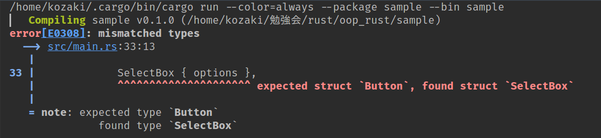
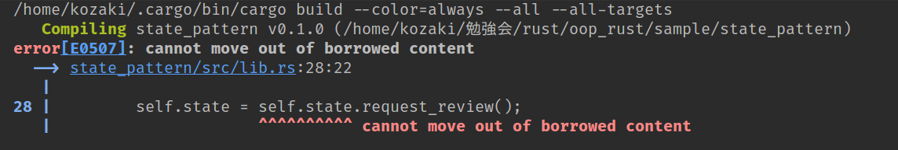

---
# Rust Book 勉強会 \#8

@size[smaller](Rust のオブジェクト指向的な機能)

---
## おことわり
<hr/>

- オブジェクト指向については知っているものとします
- オブジェクト指向の良し悪しについては言及しません

---
## もくじ
<hr/>

1. オブジェクト指向とは
2. トレイトオブジェクト
3. オブジェクト指向的実装例

---

1. @css[text-white](オブジェクト指向とは)
2. @css[text-gray](トレイトオブジェクト)
3. @css[text-gray](オブジェクト指向的実装例)


---
## オブジェクト指向とは

次のような機能を持つプログラミング言語を一般的にオブジェクト指向言語と呼ぶ（諸説あります）

- オブジェクト
  - データと振る舞いを一つにまとめて扱える|
- カプセル化
  - データを隠蔽することで抽象度を上げる|
- 継承
  - オブジェクトから振る舞いを引き継げる|

---
### Rust はオブジェクトの機能を持っているか？

`struct` や `enum` がある。

impl ブロックで、構造体や列挙体に振るまいを追加している、とみなすことができる。

---
### Rust はカプセル化の機能を持っているか？

`pub` がある。

アイテム（モジュール、構造体、関数 など）に対して、公開・非公開を選択することで、APIとして必要な機能を外部に公開することができる。

---
### Rust は継承の機能をもっているか？

　
　
　

@snap[midpoint fragment]
@size[1.8em](ありません)
@snapend

---
### 結論

　
　
　

@snap[midpoint fragment]
２勝１敗でRustはオブジェクト指向言語である
@snapend

+++

だから何か”よい”ということではありません

---

1. @css[text-gray](オブジェクト指向とは)
2. @css[text-white](トレイトオブジェクト)
3. @css[text-gray](オブジェクト指向的実装例)

---
## トレイトオブジェクト

Rustには継承はない。

しかし、われわれが継承で欲しいのは、コードの共有ではなく、ポリモーフィズムだ。

@ul
- 継承によりコードを共有
  - 密結合 &#x1f635;
- インターフェースの利用
  - 粗結合 &#x1f60a;
@ulend

---
### トレイトオブジェクトとは

<table>
    <tr>
        <th>トレイト<th>
        <td>Draw</td>
    </tr>
    <tr>
        <th>トレイトオブジェクト(1)</th>
        <td>&dyn Draw</td>
    </tr>
    <tr>
        <th>トレイトオブジェクト(2)</th>
        <td>Box&lt;dyn Draw&gt;</td>
    </tr>
</table>

+++

`Draw` を実装するあらゆる型 `T` に対して、`&T` は `&dyn Draw` に合致し、`Box<T>` は `Box<dyn Draw>` と合致する。

大まかに、`&dyn Draw` はファット・ポインタとなっており、`T` 型の値を指すアドレスと、`T` 型が実装している `Draw` のメソッドの一覧（= vtable）を保持している。

---
### 例（Draw提供側）

```rust
pub trait Draw {
    fn draw(&self);
}
pub struct Screen {
    pub components: Vec<Box<dyn Draw>>
}
impl Screen {
    pub fn run(&self) {
        for component in self.components.iter() {
            component.draw();
        }
    }
}
```
@[1-3](普通のトレイトの定義)
@[4-6](`Box<dyn Drow>`を要素にもつベクトルをもつ構造体)
@[7-12](`Draw`を実装している型が何であっても動作する)

---
### C++ とほとんど同じ

- `Draw` は抽象メソッド`draw`を持つクラス
- 任意の `Draw` のサブタイプを格納する `vector` を作るために `vector<unique_ptr<Draw>>`を用意する

---
### 例（Draw利用側）

```rust
pub struct Button {
    // ...
}
impl Draw for Button {
    fn draw(&self) {
        // ...
    }
}
pub struct SelectBox {
    // ...
}
impl Draw for SelectBox {
    // ...
}
fn main() {
    let screen = Screen {
        components: vec![
            Box::new(SelectBox { ... })
            Box::new(Button { ... })
        ]
    };
    screen.run();
}
```

@[1-14](利用側が任意に`Draw`を実装する)
@[15-23](実際の型からトレイトオブジェクトを作成する)

---
### ジェネリックスとの違い（１）

先の`Screen`をジェネリックスを用いて定義したとする

```rust
pub struct Screen<T: Draw> {
    pub components: Vec<T>
}
impl<T> Screen<T> where T: Draw {
    pub fn run(&self) {
        for component in self.components.iter() {
            component.draw();
        }
    }
}
```

---
### ジェネリックスとの違い（２）

クライアントが困る

```rust
fn main() {
    let screen = Screen {
        components: vec![
            Button { ... },
            SelectBox { ...},
        ]
    };
    screen.run();
}
```


---
### オブジェクト安全

トレイトオブジェクトは任意のトレイトに対して作成できるわけではない。

トレイトが定義する関数が次の条件を満たす必要がある（十分ではないが、実用上は十分）

- 戻り値が Self でない|
- ジェネリックパラメータを持たない|

---
#### 戻り値が`Self`でない

トレイトオブジェクトは、そのトレイト（例えば`Draw`）だけから、その内容を決定できる（= コンパイルできる）必要がある。

戻り値が `Self` となる場合、トレイトを実装した具体的な型（例`Button`）が未定な状態である。とみなされる

@css[text-gray](かなり誤魔化した説明)

---
#### ジェネリックパラメータを持たない

同じく、ジェネリックパラメータをもつ関数も、トレイトのみではその型パラメータを指定することができず、トレイトオブジェクトを作成することができない。

ただし、トレイトの関連型(Associated Type)は、トレイトオブジェクトを
`&dyn Draw<Item=i32>`のように指定することで、関連型ごとにトレイトオブジェクトを作成できる。

---
#### オブジェクト安全でない例

`Clone`トレイトを考えると、これは`Self`を戻り値としており、オブジェクト安全ではない

```rust
pub trait Clone {
    fn clone(&self) -> Self
}
```

`Self`を戻り値にできる、という機能はRustの特徴的な機能

+++
#### Java では

```java
class Object {
    //...
protected Object clone() { /* ... */ }
}

interface Clonable {}
```
@[1-4](すべてのクラスの親クラスに clone がある)
@[3](protected なので単純には使えない)
@[6](うまく clone できることを示すだけのマーカー)

---

1. @css[text-gray](オブジェクト指向とは)
2. @css[text-gray](トレイトオブジェクト)
3. @css[text-white](オブジェクト指向的実装例)

---
## オブジェクト指向実装例

#### ステートパターン


- コンテキストは内部状態（ステート）を持つ
- 状態はステートインターフェースのサブタイプ
- 状態に応じた振る舞いをサブタイプが実装する

---

### 写経してハマった所（ザ・素人）

1. `Post`構造体が、トレイトオブジェクトを`Option`型で包んでいる
2. `approve`メソッド等の引数が`self`では動かない
3. `State`トレイトが`approve`メソッド等に対してデフォルトの実装を持てない

@snap[fragment]
@css[text-gray](すべて答えが書いてあった)
@snapend

---

#### Option&lt;Box&lt;dyn Draw&gt;&gt;

`Post`の`state`が`Option`に包まれている

```rust
pub struct Post {
    state: Option<Box<dyn State>>,
    content: String,
}
```
@[2](直接Box&lt;dyn State&gt;ではだめなのか？)
@[1-4](ステートを保持しないPostは存在しないのでは？)

---
#### 間違った定義

次のように定義したとすると

```rust
pub struct Post {
    state: Box<dyn State>,
    content: String,
}
```

`approve`などは次のような実装（を私はした）

```rust
pub fn approve(&mut self) {
    self.state = self.state.approve();
}
```

---
#### コンパイルエラー



`Post`が所有している`state`を一瞬足りとも`move`することはできない！

---
#### Option::take のチカラ

```rust
pub fn approve(&mut self) {
    if let Some(state) = self.state.take() {
        self.state = Some(state.approve());
    }
}
```
@[2](Postが保持しているstateを取り出して、代わりにNoneで埋める)
@[3](取り出したstateから次の状態を求めて、穴埋めする)

---
#### Optionは面倒くさい

その代わり`content`の実装が回りくどくなっている

```rust
pub fn content(&self) -> &str {
    self.state.as_ref().unwrap().content(&self)
}
```
@[2](借用しているOption&lt;Box&lt;dyn State&gt;&gt;からBox&lt;dyn State&gt;を借用しなおしてから、State の contentを呼ぶ)

---
#### メソッドの引数問題

`approve` メソッド等の引数が `self:Box<Self>` になっている理由がわからない

```rust
pub trait State {
    fn approve(self: Box<Self>) -> Box<dyn State>;
    //...
}
```

---
#### `self`引数に渡されるのは Box&lt;dyn State&gt;ではない

試しに、`fn approve(self) -> Box<dyn State>`と宣言を変えてみる。


ステータスを変化させない実装で問題が起こっている

---
#### approve に Box&lt;dyn State&gt; をそのまま move したい

`Post` 側の `approve` から `State` の `approve` は次のように呼ばれている

```rust
pub fn approve(&mut self) {
    if let Some(state) = self.state.take() {
        self.state = Some(state.approve());
    }
}
```
@[2](ここで得られる state は`Option`を剥がされた `Box<dyn State>`)
@[3](この approve の引数が self だと、自動的にBoxが指す先がselfに渡る)

---
#### 引数の指定による解決

```rust
pub trait State {
    fn approve(self: Box<Self>) -> Box<dyn State>;
    //...
}
```

こうすると

```rust
pub fn approve(&mut self) {
    if let Some(state) = self.state.take() {
        self.state = Some(state.approve());
    }
}
```

ここで `approve` に `Box<Draft>` をそのまま渡せる。

---
#### コードの重複を除きたい

`approve` メソッドはほとんどの場合 `self` を返すので、デフォルトの実装としたい

```rust
pub trait State {
    fn approve(self: Box<Self>) -> Box<dyn State> {
        self
    }
    //...
}
```

---
#### コンパイルエラー


@snap[midpoint text-20 text-white fragment]
わかりません
@snapend

---
### わかりません
<hr/>

@quote[This would violate object safety, because the trait doesn't know what the concreate `self` will be exactly.]

---
### トレイトオブジェクトによる実装の欠点

- 状態の遷移を各状態が知っている|
  - 状態同士が密結合になっている|
  - 状態を追加する場合にその状態遷移が容易でない|
- コードの重複|
  - Stateのデフォルト実装が難しい|
  - PostのメソッドをStateに委譲するコードの重複|

---
### 状態を型として表現する別の戦略

トレイトオブジェクトとして”統一的に”扱うのをやめて、完全に独立した型とする

```rust
fn main() {
    let mut post = Post::new();
    post.add_text("I ate a salad for lunch today");
    //...
}
```
@[2](Post::new で実際には DraftPost が返される)
@[3](DraftPost には add_text メソッドが定義されている)

---
#### 状態を提供する側

```rust
pub struct Post {
    content: String,
}
pub struct DraftPost {
    content: String,
}
impl Post {
    pub fn new() -> DraftPost {
        DraftPost { content: String::new() }
    }
    pub fn content(&self) -> &str { &self.content }
}
impl DraftPost {
    pub fn add_text(&mut self, text: &str) {
        self.content.push_str(text);
    }
}
```
@[7-8](Post::new も普通の関数なので DraftPost を返却できる)
@[11](Post は内容を公開しているが、書き込みはない)
@[13-14](書き込みは DraftPost にある)

---
#### 状態の遷移

```rust
impl DraftPost {
    pub fn request_review(self) -> PendingReviewPost {
        PendingReviewPost { content: self.content }
    }
}
impl PendingReviewPost {
    pub fn approve(self) -> Post {
        Post { content: self.content }
    }
}
```
@[1-2](DraftPost -> PendingReviewPost と型自体が変わる)
@[6-7](PendingReviewPost -> Post と型自体が変わる)
@[1-10](承認されることで、Post 構造体に戻る。つまり公開できる)

---
#### 所感

- 無駄なメソッドの実装は減っている
- Content と State を分離する、というステートパターンの思想は失われている
- 状態の遷移が見通し良くなったかと言うと、そうでもない

---
## 結論

- Rust はある意味でオブジェクト指向言語である
- トレイトオブジェクトの機能により、動的にメソッドの実行を切り替えることができる
- オブジェクト指向的な設計だけが選択肢ではない